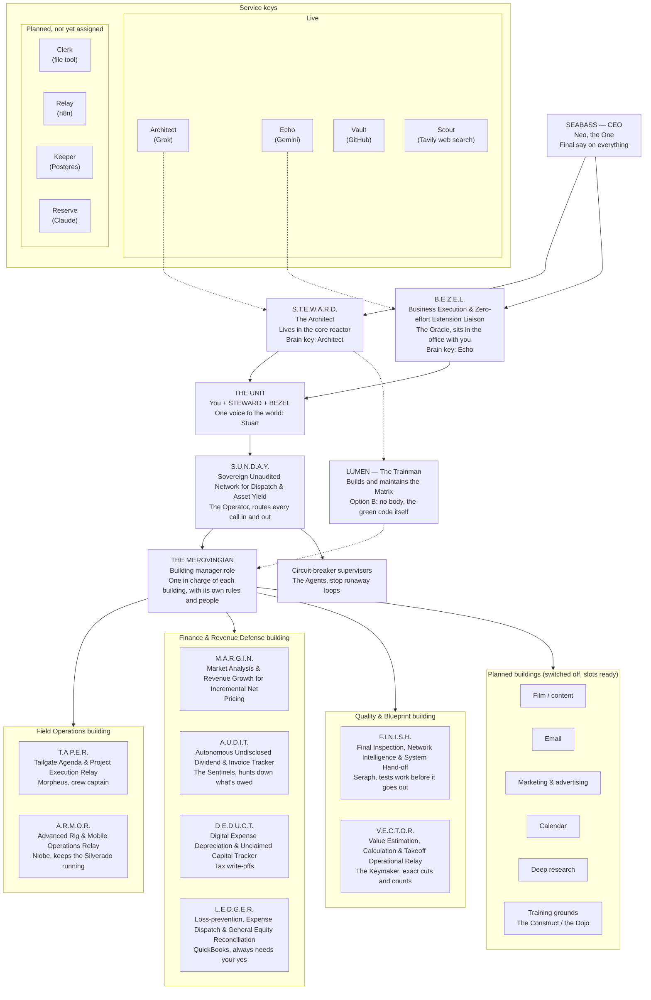

# Cross Coat Matrix — Mind Map (end-goal vision)

This is the planning picture of the Matrix, not a description of what is coded today.
Service keys are shown by their nicknames. Live keys are in `.env` and working;
planned keys are not assigned yet.

