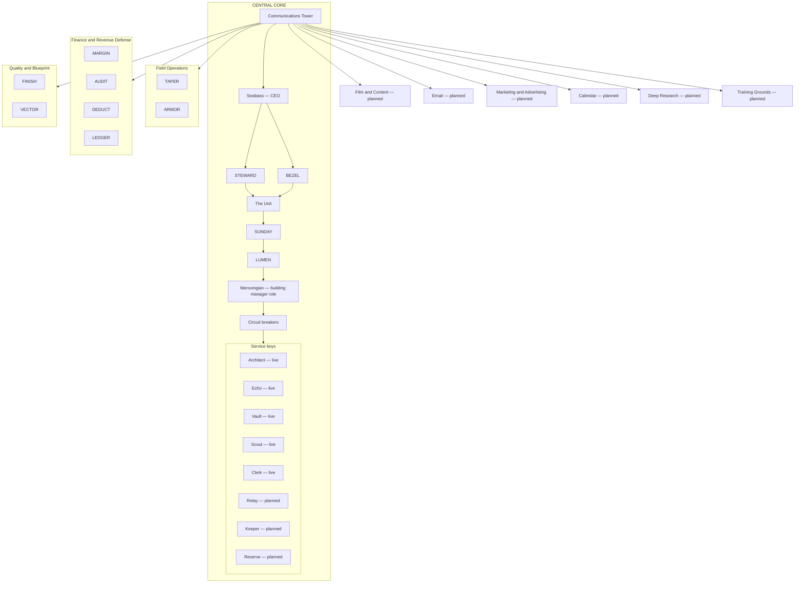

# Cross Coat Matrix — Structure

The town has one centre building, the Central Core. Inside the Core, everything is
arranged in strict levels from top to bottom. The Communications Tower sits at the top
level and is the single point that all traffic routes through. Lines run from the Tower
to every other building in the town.

Service keys marked "planned" are not assigned yet.

## Levels inside the Central Core

1. Communications Tower
2. Seabass — CEO
3. STEWARD and BEZEL (equal rank)
4. The Unit
5. SUNDAY
6. LUMEN
7. Merovingian — building manager role
8. Circuit breakers
9. Service keys — Architect, Echo, Vault, Scout, Clerk (live); Relay, Keeper, Reserve (planned)

## Buildings connected to the Communications Tower

- Field Operations — TAPER, ARMOR
- Finance and Revenue Defense — MARGIN, AUDIT, DEDUCT, LEDGER
- Quality and Blueprint — FINISH, VECTOR
- Film and Content — planned
- Email — planned
- Marketing and Advertising — planned
- Calendar — planned
- Deep Research — planned
- Training Grounds — planned
