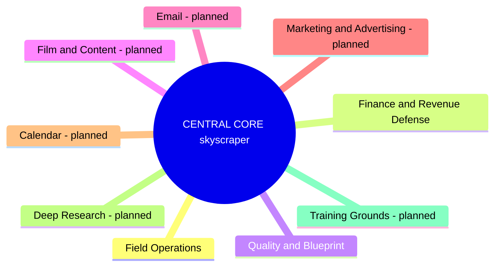
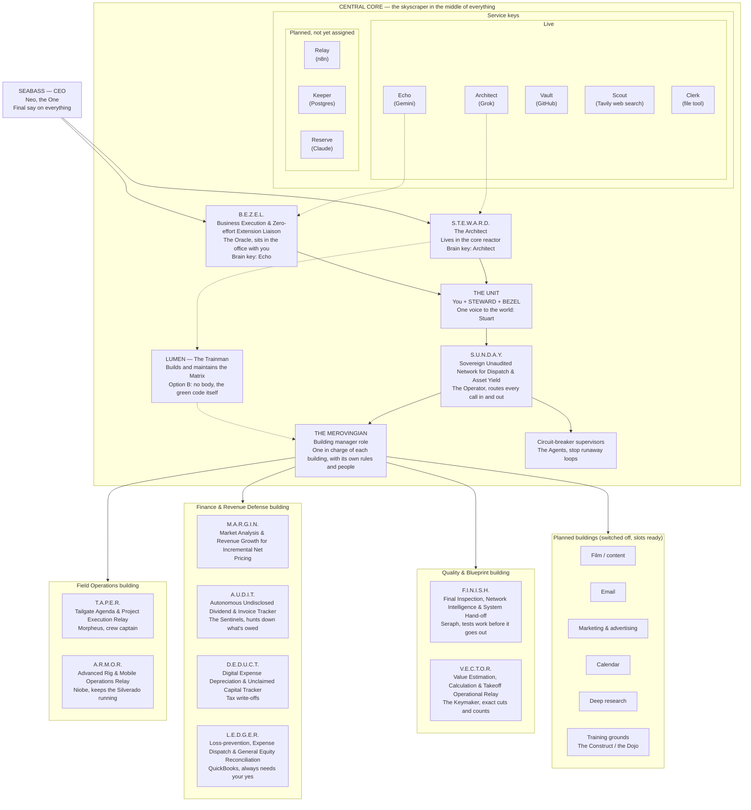

# Cross Coat Matrix — Mind Map (end-goal vision)

This is the planning picture of the Matrix, not a description of what is coded today.
The Central Core is the skyscraper in the middle of everything. Service keys are shown
by their nicknames. Live keys are in `.env` and working; planned keys are not assigned yet.

## 3D layout: the city from above

The Central Core skyscraper stands in the exact centre of the Matrix. Every other
building stands in a ring around it, at equal distance, so the Core can reach each one
directly. Going clockwise from the front door: Field Operations, Finance and Revenue
Defense, Quality and Blueprint, then the planned buildings for Film and Content, Email,
Marketing and Advertising, Calendar, Deep Research, and the Training Grounds. Planned
buildings stand in the ring switched off until they are opened.

## Chain of command: who reports to whom

