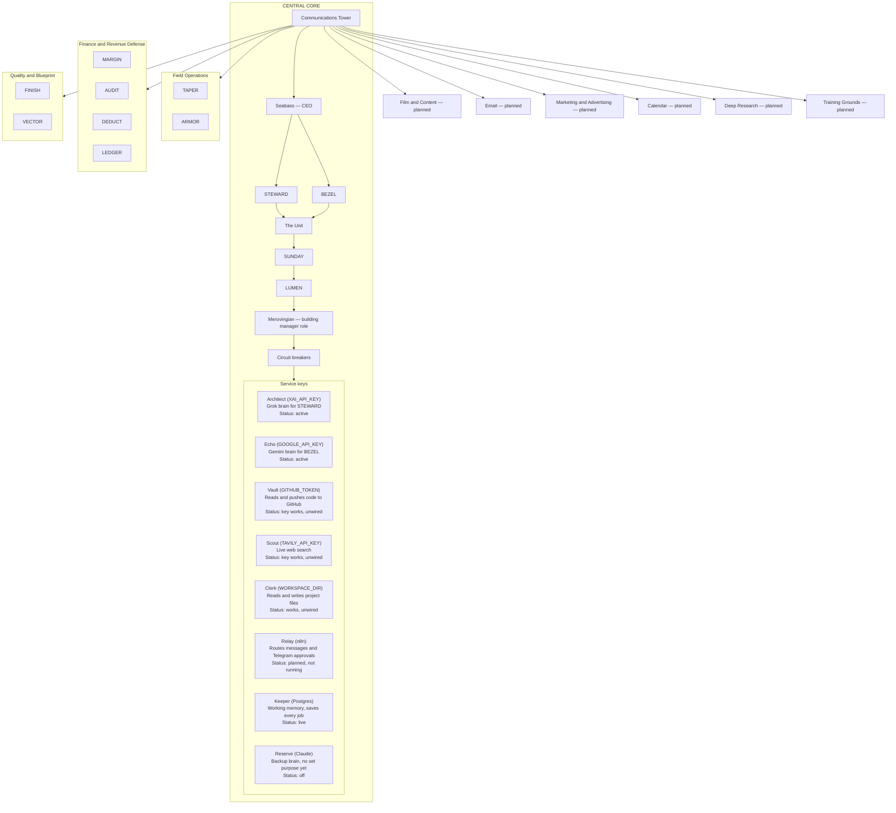

# Cross Coat Matrix — Structure

The town has one centre building, the Central Core. Inside the Core, everything is
arranged in strict levels from top to bottom. The Communications Tower sits at the top
level and is the single point that all traffic routes through. Lines run from the Tower
to every other building in the town.

Each service desk shows its nickname, the key or service behind it, its job, and its status.

## Levels inside the Central Core

1. Communications Tower
2. Seabass — CEO
3. STEWARD and BEZEL (equal rank)
4. The Unit
5. SUNDAY
6. LUMEN
7. Merovingian — building manager role
8. Circuit breakers
9. Service keys (desks):
   - Architect (`XAI_API_KEY`): Grok brain for STEWARD. Active.
   - Echo (`GOOGLE_API_KEY`, Gemini): Gemini brain for BEZEL. Active.
   - Vault (`GITHUB_TOKEN`): reads and pushes code to GitHub. Key works, no agent uses it yet.
   - Scout (`TAVILY_API_KEY`): live web search. Key works, no agent uses it yet.
   - Clerk (`WORKSPACE_DIR`): file tool that reads and writes project files. Works, no agent uses it yet.
   - Relay (n8n): routes messages and Telegram approvals. Planned, not running.
   - Keeper (Postgres): working memory that saves every job. Live.
   - Reserve (Claude): backup brain. Off, no clear purpose yet.

## Buildings connected to the Communications Tower

- Field Operations — TAPER, ARMOR
- Finance and Revenue Defense — MARGIN, AUDIT, DEDUCT, LEDGER
- Quality and Blueprint — FINISH, VECTOR
- Film and Content — planned
- Email — planned
- Marketing and Advertising — planned
- Calendar — planned
- Deep Research — planned
- Training Grounds — planned
