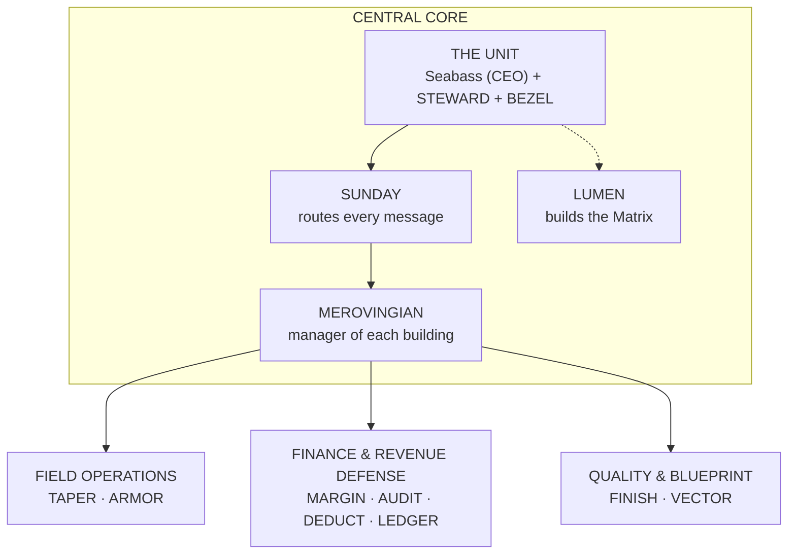

# Cross Coat Matrix — Simple Map

The quick-glance version. For every level and service key, see [MIND_MAP.md](MIND_MAP.md).

| Piece | One-line job |
| --- | --- |
| The Unit | You make every final call; STEWARD and BEZEL are your two senior staff, equal rank |
| SUNDAY | Reads each message and sends it to the right place |
| LUMEN | Builds and upgrades the Matrix itself |
| Merovingian | Runs each building day to day and passes work up for approval |
| Field Operations | Crew day plans (TAPER) and the truck and rigs (ARMOR) |
| Finance & Revenue Defense | Pricing (MARGIN), money owed (AUDIT), write-offs (DEDUCT), QuickBooks (LEDGER) |
| Quality & Blueprint | Checks work before it goes out (FINISH), takeoffs and counts (VECTOR) |

Planned buildings (film, email, marketing, calendar, deep research, training grounds) are left off this view on purpose.
