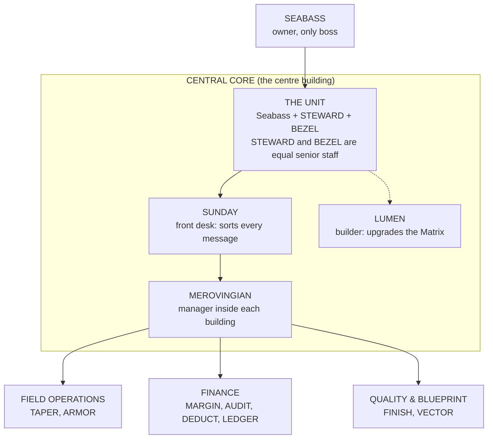

# Cross Coat Matrix — Simple Map

**Read this first.** A plain-language picture of this world for anyone, human or AI, joining the
project. For every level and service key, see [MIND_MAP.md](MIND_MAP.md). For how it gets built,
see [TIMELINE.md](TIMELINE.md).

## What this is, in five sentences

1. The Cross Coat Matrix is a team of AI workers being built for Cross Coat Drywall, a drywall company in La Crête, Alberta.
2. Seabass Krahn owns the company and is the only boss (CEO); AI workers draft, and nothing is sent, paid, deleted or decided without his yes.
3. Right now the Matrix's only job is to build itself; it does not yet run the business.
4. It is pictured as a small town: one tall centre building (the Central Core) that holds the leadership, and work buildings around it.
5. Anything **built** works today in code; anything **planned** is a design only.

## The map

## Who does what, and is it built?

| Who | Plain job | Reports to | Status |
| --- | --- | --- | --- |
| Seabass | Owner. Approves everything that leaves the chat | Nobody | — |
| STEWARD | Senior staff. Runs on Grok | Seabass | Built |
| BEZEL | Senior staff, equal to STEWARD. Planned to run on Gemini | Seabass | Built |
| SUNDAY | Reads each message and sends it to the right worker | STEWARD / BEZEL | Built |
| LUMEN | Builds new features for the Matrix | Whichever brain is active | Planned |
| Merovingian | One manager per building | SUNDAY | Planned |
| TAPER, ARMOR | Crew day plans; truck and rig care | Field Operations | Built as workers, no real apps yet |
| MARGIN, AUDIT, DEDUCT, LEDGER | Pricing; money owed; tax write-offs; QuickBooks | Finance | Built as workers, no real apps yet |
| FINISH, VECTOR | Final checks; takeoffs and counts | Quality & Blueprint | Built as workers, no real apps yet |

**Built today** also includes: the approval gate (stops for Seabass's yes), switching between Grok
and Gemini, and working keys for Grok, Gemini, GitHub, Tavily web search and a file tool.

**Planned:** Keeper (database memory), Relay (n8n hub), the Communications Tower, Telegram
approvals, circuit breakers, the 3D town, and new buildings for email, calendar, research,
marketing, film and training.

## Core relationships

- Every message goes in through SUNDAY, then to STEWARD or BEZEL, then to a worker.
- Workers only draft. Anything that would change the outside world stops for Seabass's yes.
- Disagreements go up one level at a time: worker, supervisor, building manager, senior staff, Seabass.
