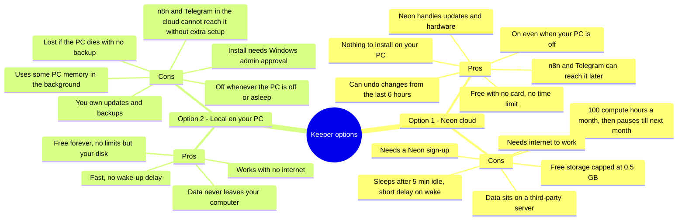

# Keeper (Postgres) — Option Comparison

Keeper is the Matrix's long-term memory: the database where agents store and look up
facts, jobs, and history. Two options are on the table. Nothing has been set up yet;
this page is for deciding.

Neon figures are from neon.com (plans and pricing pages), checked Sep 27, 2026.

## Side by side

| Factor | Option 1: Neon cloud | Option 2: Local on your PC |
| --- | --- | --- |
| Cost | $0. Free plan, no credit card, no expiry. Paid plan is pay-as-you-go only if you outgrow it. | $0. Postgres is free software. |
| Available when your PC is off | Yes. | No. |
| Setup difficulty | Easy. Sign up with Google, copy one connection key into `.env`. | Moderate. Windows installer, admin prompt, set a password, keep the service running. |
| Security and privacy | Encrypted connection; data stored with Neon. Key lives only in `.env`. | Data stays on your machine. Only as safe as the PC itself. |
| Reachable by n8n and Telegram later | Yes, directly over the internet. | Not without extra work (opening the PC to the internet or a tunnel), and only while the PC is on. |
| Backup and reliability | Neon runs the hardware. Free plan can restore to any point in the last 6 hours, plus 1 manual snapshot. | No backup unless one is set up. A dead drive loses everything. |
| Size limits | 0.5 GB free — plenty for text memory and job records for a long time. | Limited only by disk space. |
| Usage limits | 100 compute hours a month; it sleeps after 5 minutes idle, so light use stays well inside this. If hit, it pauses until next month. | None. |
| Speed | A short wake-up pause after it has been idle; otherwise quick. | Fastest; no network. |
| Internet needed | Yes. | No. |
| Moving later | Easy to copy out to another Postgres if needed. | Easy to copy up to Neon later. |

## Recommendation

Option 1, Neon. The Matrix is heading toward n8n and Telegram, which need a database that is
always reachable, and Neon gives that for free with the least setup. Option 2 makes sense only
if keeping all data on your own computer matters more than reaching it from outside.

Either way, the connection key goes only in `.env`, never in chat or in GitHub.
