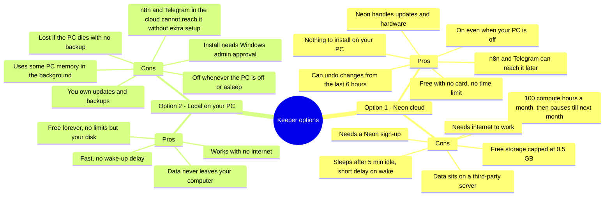

# Keeper (Postgres) — Option Comparison

Keeper is the Matrix's long-term memory: the database where agents store and look up
facts, jobs, and history. Two options are on the table. Nothing has been set up yet;
this page is for deciding.

Neon figures are from neon.com (plans and pricing pages), checked Sep 27, 2026.

## Option 1: Neon cloud 

A free Postgres database hosted online by Neon (neon.com). Always reachable, nothing installed on your PC.

## Option 2: Postgres on your own PC 

The official PostgreSQL software (postgresql.org) installed on your Windows computer. Private, but only on while the PC is on.

## Free or paid

| |  Neon cloud |  Postgres on your PC |
| --- | --- | --- |
| Status | **Free** (Free plan, $0/month, no credit card, no expiry) | **Free** (open-source software, $0 forever) |
| If you outgrow it | Launch plan, pay-as-you-go with no monthly minimum: $0.106 per compute-hour and $0.35 per GB of storage per month | No bill. The cost is a bigger drive, electricity, and your time for upkeep |

## Specs

| Spec | Neon cloud (Free plan) | Postgres on your PC |
| --- | --- | --- |
| Storage | 0.5 GB per project | Limited by free disk space: about 72 GB free on your C: drive (464 GB total) |
| Compute | 100 compute-hours per month per project; autoscales up to 2 CU (about 8 GB RAM) | Your PC: AMD Ryzen 5 5600X, 24 GB RAM, shared with everything else you run |
| Connections | 104 direct at the smallest size (97 usable); up to 10,000 through Neon's built-in pooler | 100 by default (Postgres standard setting), can be raised |
| Idle behaviour | Sleeps after 5 minutes idle (fixed on Free), wakes in a few hundred milliseconds on the next request | Never sleeps while the PC is on; fully off when the PC is off or asleep |
| Monthly limits | 100 compute-hours, 5 GB of data sent out. Hitting either pauses the database until next month | None |
| Backups | Restore to any point in the last 6 hours (up to 1 GB of changes), plus 1 manual snapshot | None unless you set them up |
| Projects | Up to 100 projects, 10 branches each | Unlimited databases |

Neon figures are from neon.com (plans, pricing, computes and connection pooling pages), checked Sep 27, 2026. PC figures were read from your computer the same day.

## Pros and cons

## Side by side

| Factor |  Option 1: Neon cloud |  Option 2: Local on your PC |
| --- | --- | --- |
| Cost | $0. Free plan, no credit card, no expiry. Paid plan is pay-as-you-go only if you outgrow it. | $0. Postgres is free software. |
| Available when your PC is off | Yes. | No. |
| Setup difficulty | Easy. Sign up with Google, copy one connection key into `.env`. | Moderate. Windows installer, admin prompt, set a password, keep the service running. |
| Security and privacy | Encrypted connection; data stored with Neon. Key lives only in `.env`. | Data stays on your machine. Only as safe as the PC itself. |
| Reachable by n8n and Telegram later | Yes, directly over the internet. | Not without extra work (opening the PC to the internet or a tunnel), and only while the PC is on. |
| Backup and reliability | Neon runs the hardware. Free plan can restore to any point in the last 6 hours, plus 1 manual snapshot. | No backup unless one is set up. A dead drive loses everything. |
| Size limits | 0.5 GB free — plenty for text memory and job records for a long time. | Limited only by disk space. |
| Usage limits | 100 compute hours a month; it sleeps after 5 minutes idle, so light use stays well inside this. If hit, it pauses until next month. | None. |
| Speed | A short wake-up pause after it has been idle; otherwise quick. | Fastest; no network. |
| Internet needed | Yes. | No. |
| Moving later | Easy to copy out to another Postgres if needed. | Easy to copy up to Neon later. |

## Recommendation and success scores

These percentages are my estimates of how likely each option is to succeed for the Cross Coat
Matrix. They are judgement calls based on the specs above and the plan for the Matrix (n8n,
Telegram, agents running while you're on site), not measured data.

| Success factor | Weight | Neon cloud | Postgres on your PC | Why |
| --- | --- | --- | --- | --- |
| Supports the project long-term | 25% | 80% | 55% | Neon's 0.5 GB will hold text memory for a long time, and upgrading is cheap. A home PC wears out and needs upkeep |
| Works with n8n and Telegram | 25% | 95% | 35% | Neon is reachable from the internet. A PC database needs a tunnel or open port and only works while the PC is on |
| Survives your computer being off | 20% | 98% | 10% | Neon doesn't depend on your PC. Local goes down with the PC |
| Scales as the business grows | 15% | 90% | 50% | Neon grows on a paid plan with a few clicks. Local is capped by one PC's disk and memory |
| Setup works first time | 10% | 90% | 75% | Neon needs a sign-up and one key. Local needs an installer, an admin prompt, and a service to keep running |
| Privacy and control | 5% | 65% | 95% | Local keeps every byte at home. Neon stores data on its servers |
| **Overall success score** | 100% | **89%** | **44%** | Weighted average of the rows above |

**Recommendation: Option 1, Neon.** It scores about twice as high, mainly because the Matrix needs
a database that is reachable by n8n and Telegram and stays up when your computer is off. Choose
Option 2 only if keeping all data on your own computer matters more than everything else.

Either way, the connection key goes only in `.env`, never in chat or in GitHub.
